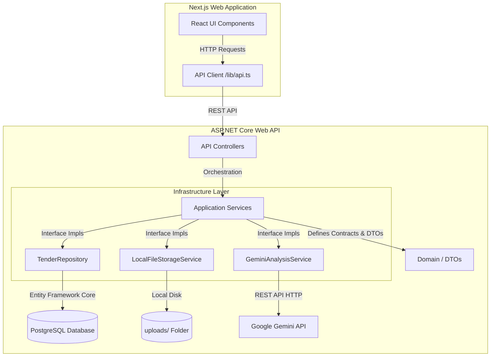
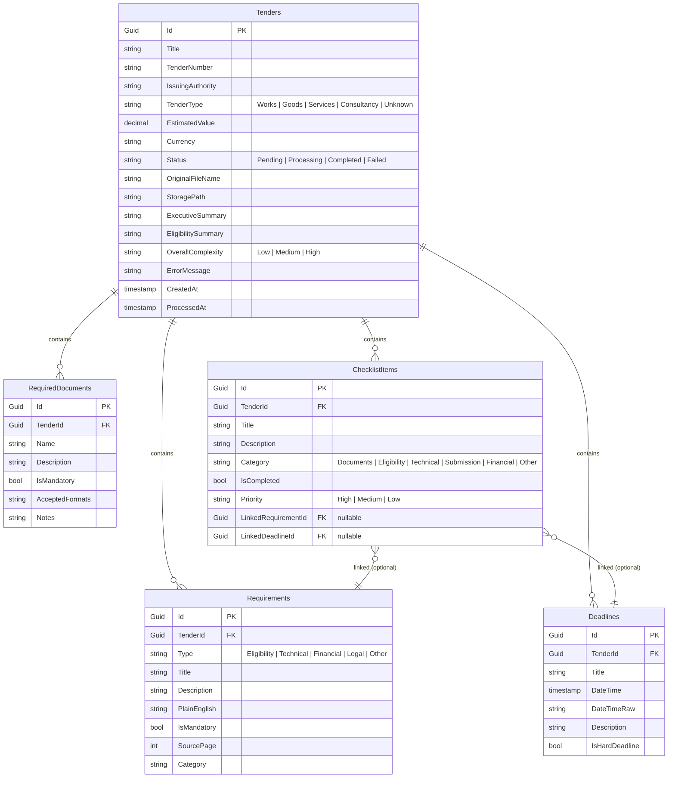

# TenderPro AI — Tender & RFP Document Analyzer

TenderPro is a state-of-the-art web application that leverages the power of advanced AI to extract, analyze, and track eligibility requirements, deadlines, required documents, and compliance checklists from complex, multi-page government tenders and RFPs (Request for Proposal).

---

## 📌 Problem Statement & Solution

### The Challenge
Government and corporate procurement tender documents are typically long, dense, and confusing PDF files containing hundreds of pages of legal, financial, and technical jargon. Contractors and bidding organizations struggle with:
*   **Missed Deadlines**: Overlooking critical dates like pre-bid meetings, query submissions, and technical bid openings.
*   **Eligibility Failures**: Finding out late that they do not meet financial turnover or technical experience requirements.
*   **Missing Documents**: Missing a single required attachment or certificate, leading to immediate disqualification.
*   **Compliance Tracking**: Manually compiling checklists of deliverables across fragmented pages of requirements.

### The Solution
**TenderPro** streamlines this process by providing an interactive compliance dashboard:
1.  **AI Extraction**: Instantly parses and extracts key data using the latest Google Gemini API (`gemini-3.5-flash`).
2.  **Plain-English Summarization**: Translates convoluted legal clauses into easily readable text.
3.  **Key Deadlines & Status Tracker**: Tracks critical dates, calculating remaining days dynamically relative to UTC time.
4.  **Interactive Checklist**: Auto-generates a prioritized checklist categorized by topic (documents, financial, eligibility) allowing bidding teams to track their preparation.

---

## 🏗️ Architecture Overview

TenderPro is designed using **Clean Architecture** patterns in ASP.NET Core for a decoupled, maintainable, and testable codebase, integrated with a modern **Next.js** frontend.



### Flow of Data: Document Upload & Analysis
1.  **Upload**: The user uploads a PDF tender document from the Next.js frontend.
2.  **Save Local**: The backend API saves the raw file to disk with a GUID prefix for uniqueness.
3.  **AI Query**: The PDF is processed and converted to Base64, then sent to the Gemini API with a system prompt and a strict JSON response schema.
4.  **Database Mapping**: The structured JSON response is mapped into EF Core entities. Enums are converted to strings, and dates are normalized.
5.  **Persistence**: The tender and its associated requirements, deadlines, required documents, and compliance checklists are saved in a PostgreSQL database in a single transaction.
6.  **Response**: The frontend receives a rich `TenderDetailDto` and displays the interactive dashboard.

---

## 💻 Technology Stack

### Backend
*   **Runtime**: .NET 10.0
*   **Web Framework**: ASP.NET Core Web API
*   **Database Access**: Entity Framework Core 10.0 (EF Core)
*   **Database Provider**: Npgsql.EntityFrameworkCore.PostgreSQL (PostgreSQL)
*   **AI Integration**: HttpClient calling Google Gemini API (`gemini-3.5-flash`)
*   **Documentation**: Swagger UI / OpenAPI

### Frontend
*   **Framework**: Next.js 16 (App Router)
*   **Library**: React 19, TypeScript
*   **Styling**: Premium Vanilla CSS (custom properties, responsive layout grids, glassmorphism UI, transitions)
*   **Fonts**: Outfit (imported via Google Fonts)

---

## 🗄️ Database Schema & Data Models

TenderPro uses PostgreSQL (default port 5433). The database maps 5 core tables with strict foreign keys and **cascade deletes**.



---

## 📂 Folder Structure

```text
TenderPro/
├── backend/
│   ├── src/
│   │   ├── TenderPro.Domain/
│   │   │   ├── Entities/
│   │   │   │   ├── Tender.cs             # Root Aggregate Entity & Enums
│   │   │   │   ├── Requirement.cs        # Tender eligibility requirements
│   │   │   │   ├── Deadline.cs           # Dynamic and raw dates
│   │   │   │   ├── RequiredDocument.cs   # Attachment details
│   │   │   │   └── ChecklistItem.cs      # Checklist entities and categories
│   │   │   └── TenderPro.Domain.csproj
│   │   ├── TenderPro.Application/
│   │   │   ├── DTOs/
│   │   │   │   ├── AnalysisResultDto.cs  # Gemini Schema structures
│   │   │   │   └── TenderDtos.cs         # API Request/Response DTOs
│   │   │   ├── Interfaces/
│   │   │   │   ├── IAiAnalysisService.cs
│   │   │   │   ├── IFileStorageService.cs
│   │   │   │   └── ITenderRepository.cs
│   │   │   ├── Services/
│   │   │   │   └── TenderProcessingService.cs # Core orchestration service
│   │   │   └── TenderPro.Application.csproj
│   │   ├── TenderPro.Infrastructure/
│   │   │   ├── AI/
│   │   │   │   └── GeminiAnalysisService.cs   # Gemini structured JSON caller
│   │   │   ├── Data/
│   │   │   │   ├── Repositories/
│   │   │   │   │   └── TenderRepository.cs    # EF Core CRUD Repository
│   │   │   │   └── TenderProDbContext.cs      # EF Core DbContext mapping
│   │   │   ├── Storage/
│   │   │   │   └── LocalFileStorageService.cs # Uploads directories manager
│   │   │   ├── Migrations/
│   │   │   └── TenderPro.Infrastructure.csproj
│   │   └── TenderPro.API/
│   │       ├── Controllers/
│   │       │   ├── TendersController.cs       # Upload, query, delete endpoints
│   │       │   └── ChecklistController.cs     # Checklist updating endpoints
│   │       ├── appsettings.json               # Backend settings
│   │       ├── Program.cs                     # Services injection & startup
│   │       └── TenderPro.API.csproj
│   └── TenderPro.slnx                         # Solution file
└── frontend/
    ├── src/
    │   ├── lib/
    │   │   └── api.ts                         # Fetch client wrapper
    │   └── app/
    │       ├── layout.tsx                     # Fonts & metadata setup
    │       ├── globals.css                    # Design system (CSS Variables)
    │       ├── page.tsx                       # Upload home page & tenders list
    │       └── tender/
    │           └── [id]/
    │               └── page.tsx               # Details compliance dashboard
    ├── package.json                           # Next.js configurations
    └── tsconfig.json                          # TypeScript configs
```

---

## 🛠️ Codebase Walkthrough

### Main Backend Files

#### 1. [TenderProcessingService.cs](file:///c:/Users/tejal/Downloads/TenderPro/backend/src/TenderPro.Application/Services/TenderProcessingService.cs)
*   **Role**: Orchestrates the analysis pipeline.
*   **Key Logic**:
    - Creates a pending database record first so that the user sees a "Processing" status.
    - Saves the file to disk using `IFileStorageService`.
    - Passes the file to `IAiAnalysisService`.
    - Maps the structured AI response to `Requirement`, `Deadline`, `RequiredDocument`, and `ChecklistItem` entities.
    - Saves all items in a single database transaction via `ITenderRepository.SaveChangesAsync()`.
    - Contains parsing helpers for converting string representations from the AI model to Domain Enums (e.g. `TenderType`, `ComplexityLevel`, `ChecklistPriority`).

#### 2. [GeminiAnalysisService.cs](file:///c:/Users/tejal/Downloads/TenderPro/backend/src/TenderPro.Infrastructure/AI/GeminiAnalysisService.cs)
*   **Role**: Interfaces with Google Gemini API (`gemini-3.5-flash`).
*   **Key Logic**:
    - Formulates instructions demanding extraction of all procurement criteria in plain English.
    - Employs a detailed `responseSchema` defining types (`OBJECT`, `ARRAY`, `STRING`, `BOOLEAN`) to ensure the API outputs valid JSON directly. This removes the need for unstable post-processing regex or parsing logic.

#### 3. [TenderProDbContext.cs](file:///c:/Users/tejal/Downloads/TenderPro/backend/src/TenderPro.Infrastructure/Data/TenderProDbContext.cs)
*   **Role**: Fluent API modeling for EF Core.
*   **Key Logic**:
    - Configures enum conversions (e.g., status, complexity, type) so they are stored as readable strings in PostgreSQL rather than integers.
    - Details the cascade delete triggers (deleting a `Tender` automatically removes all associated requirements, deadlines, required documents, and checklist items).
    - Ignores in-memory dynamic properties like `Deadline.DaysRemaining` so EF Core does not attempt to save them to the DB.

#### 4. [TenderRepository.cs](file:///c:/Users/tejal/Downloads/TenderPro/backend/src/TenderPro.Infrastructure/Data/Repositories/TenderRepository.cs)
*   **Role**: Encapsulates DB queries.
*   **Key Logic**:
    - Implements tracking optimization.
    - Avoids calling `db.Tenders.Update()` when an entity is already tracked by checking `db.Entry(tender).State == EntityState.Detached`. This resolves optimistic concurrency conflicts when updating child collections that have client-generated Guid IDs.

---

### Main Frontend Files

#### 1. [api.ts](file:///c:/Users/tejal/Downloads/TenderPro/frontend/src/lib/api.ts)
*   **Role**: Serves as the API interface.
*   **Key Logic**:
    - Imports typed structures corresponding to backend entities.
    - Handles uploads with `FormData` and `PATCH` requests with JSON payloads to trigger immediate status toggles.

#### 2. [page.tsx (Home Dashboard)](file:///c:/Users/tejal/Downloads/TenderPro/frontend/src/app/page.tsx)
*   **Role**: Initial screen of the application.
*   **Key Features**:
    - High-fidelity drag-and-drop file upload target zone.
    - Active visual progress indicators during analysis.
    - Grid summarizing metrics (extracted requirements, document counts, overall deadlines).
    - Data list showing all processed tenders, overall complexity scores, and a deletion trigger.

#### 3. [page.tsx (Tender Dashboard)](file:///c:/Users/tejal/Downloads/TenderPro/frontend/src/app/tender/%5Bid%5D/page.tsx)
*   **Role**: Detailed compliance control panel for a selected tender.
*   **Key Features**:
    - Dynamic sidebar summary with metrics.
    - Main panels split into functional tabs: Executive Summary, Eligibility Criteria (transcribing technical clauses to "plain-English"), Deadlines (highlighting hard/soft dates and remaining days), Required Documents, and Compliance Checklist.
    - Interactive compliance checklist allowing users to check off requirements, automatically persisting checklist completion statuses in real-time.

---

## 🚀 How to Run Locally

### Prerequisites
*   [.NET SDK 10.0](https://dotnet.microsoft.com/download)
*   [Node.js 18+](https://nodejs.org)
*   [PostgreSQL Database](https://www.postgresql.org/download/) running on port `5433` (username: `postgres`, password: `postgres`)

### 1. Database Setup
Ensure PostgreSQL is active. In your PostgreSQL instance, create a database named `tenderpro`.
Alternatively, you can modify the connection string in `backend/src/TenderPro.API/appsettings.json` to point to a different port or login credentials:
```json
"ConnectionStrings": {
  "Default": "Host=localhost;Port=5433;Database=tenderpro;Username=postgres;Password=postgres"
}
```

### 2. Backend Startup
Open your terminal in the backend directory:
```bash
cd backend
dotnet run --project src/TenderPro.API/TenderPro.API.csproj
```
*The application will automatically apply database migrations on startup and launch at `http://localhost:5123`.*
*Swagger documentation is available at `http://localhost:5123/swagger`.*

### 3. Frontend Startup
Open a new terminal in the frontend directory:
```bash
cd frontend
npm install
npm run dev
```
*The app will launch at `http://localhost:3000`.*

---

## 📡 API Endpoints Reference

### Tenders
*   `POST /api/tenders/upload`: Multipart request to upload a PDF file (`file`) for analysis. Returns the created `TenderDetailDto`.
*   `GET /api/tenders`: Lists all uploaded tenders as summaries.
*   `GET /api/tenders/{id}`: Returns the full details of a tender, including its child tables (requirements, deadlines, required documents, checklist items).
*   `DELETE /api/tenders/{id}`: Deletes a tender, its database entities, and its local storage file.

### Checklist
*   `PATCH /api/checklist/{id}`: Body `{ isCompleted: boolean }`. Updates the completion status of a checklist item.

---

## ⚙️ Environment Configuration

### Backend: `backend/src/TenderPro.API/appsettings.json`
*   `ConnectionStrings:Default`: Database URL.
*   `GeminiApiKey`: Google Gemini API credentials.
*   `FileStorage:UploadPath`: Root folder for saved tender PDFs (defaults to `uploads`).

### Frontend: `frontend/.env.local`
*   `NEXT_PUBLIC_API_URL`: Root endpoint of the backend API (defaults to `http://localhost:5123/api` in development).
